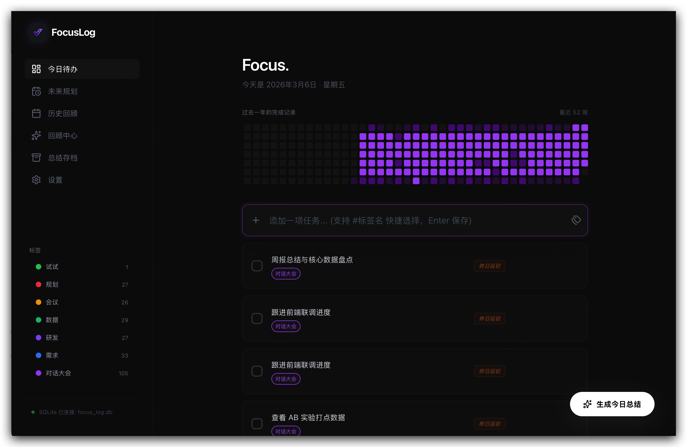

<div align="center">

# 🎯 FocusLog

**极简主义的每日焦点与待办追踪神器**


*告别繁杂的清单，找回专注的力量。*

<br>



</div>

<br>

## 🤔 我们为什么需要 FocusLog？

你是否有过这样的痛点：
- 😫 **任务列表越攒越长**：每天看着一望无际的待办事项，焦虑感拉满，无从下手。
- 🤯 **工具太复杂，沦为“做计划的奴隶”**：为了记个事，还要设优先级、定截止日期、拉项目线……操作比做事本身还累。
- 🌫️ **不知时间去哪儿了**：一周下来，感觉每天都在忙，但回头看又想不起来到底完成了什么有价值的事。
- 🛡️ **数据隐私担忧**：我的日常记录和思考，真的想全都存在云端，让别人拿去训练模型吗？

**FocusLog** 就是为了解决这些问题而生的。它不是大而全的项目管理工具，而是一个**懂你痛点、让你专注当下**的轻量级伴侣。

---

## ✨ 核心亮点：为什么它与众不同？

### 1. 🧘‍♀️ 极简的“今日”视角，斩断焦虑
FocusLog 刻意弱化了“积压列表”。主界面永远是**今天**，你只需要关注眼前最重要的事。如果今天做不完？别有压力，一键 **“推迟（Snooze）”** 到明天或下周，“眼不见心不烦”，专注解决当下的挑战。

### 2. 🟩 像开源极客一样刷“绿格子”
引入了类似 GitHub 的 **年度贡献热力图**。看着自己每天完成的任务变成一个个亮起来的方块，那种“打怪升级”的成就感，是坚持下去的最佳动力。今天也想为你自己的生活提交一个 Commit 吗？

### 3. 🤖 AI 懂你的努力，为你总结复盘
无需手动苦思冥想写周报或日记：
- **今日日志**：一键生成今天的成就总结，还会用幽默鼓励的语气夸奖你。
- **回顾中心**：选定时间范围，AI 帮你把零散的任务变成结构化的周报 / 月报。
- *所有提示词（Prompt）均可自定义，它能变成严厉的导师，也能变成温柔的树洞。*

### 4. 🏷️ 丝滑的标签管理与快捷输入
想到什么直接敲键盘，输入 `做点什么... #工作`，回车即可同时创建任务并打上标签。支持按照标签过滤你的热力图，看看自己到底把时间花在了哪些领域。

### 5. 🔒 数据绝对掌握在自己手里
基于 Tauri + Vue 3 构建的桌面应用，所有任务数据**全部存储在本地 SQLite 数据库中**（就在你的电脑里）。没有烦人的账号注册，没有漫长的数据同步，断网也能飞速运行，隐私安全 100% 拿捏。

---

## 🚀 快速开始

### 开发环境准备
确保你的电脑上安装了 [Node.js](https://nodejs.org/) (推荐 >= 20) 和 [Rust](https://www.rust-lang.org/)。

```bash
# 1. 克隆仓库
git clone https://github.com/DD-HAHA/todolist.git
cd todolist

# 2. 安装前端依赖
npm install

# 3. 启动开发环境 (Tauri 会自动启动前端 vite 和后端 rust 进程)
npm run tauri dev
```

### 构建打包
```bash
# 构建适用于你当前操作系统的安装包
npm run tauri build
```

---

## 🛠️ 技术栈
- **Frontend**: Vue 3 (Composition API) + Vite + TailwindCSS + Lucide Icons
- **Backend / Core**: Tauri v2 + Rust
- **Database**: SQLite (通过 `tauri-plugin-sql` 本地存储)
- **AI Integration**: 支持自定义 API 供应商（如 OpenAI, Anthropic, DeepSeek 等），带来强大的总结与回顾体验。

---

## 🤝 参与贡献
发现 Bug 或者有很酷的新想法？欢迎提交 Issue 或 Pull Request！别忘了先在本地通过 `npm run tauri dev` 体验一下哦。

<br>
<div align="center">
  <sub>Built with ❤️ and ☕️ for better focus.</sub>
</div>
